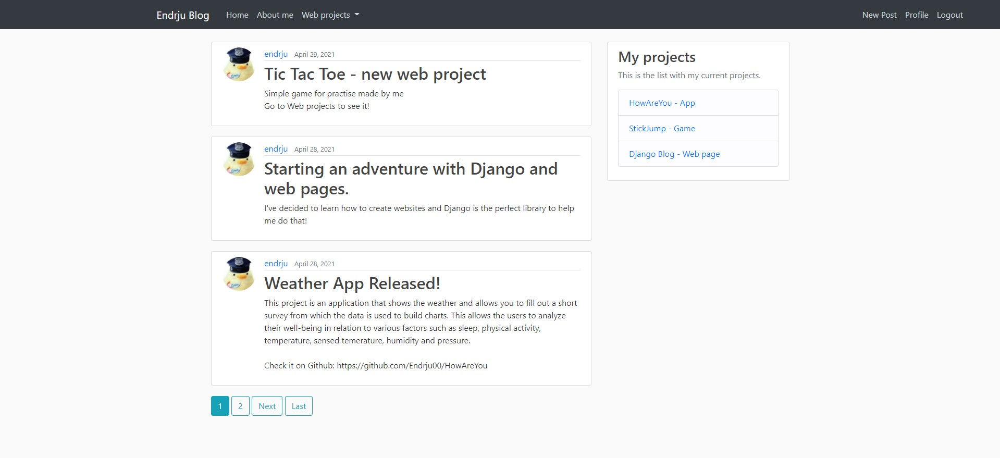
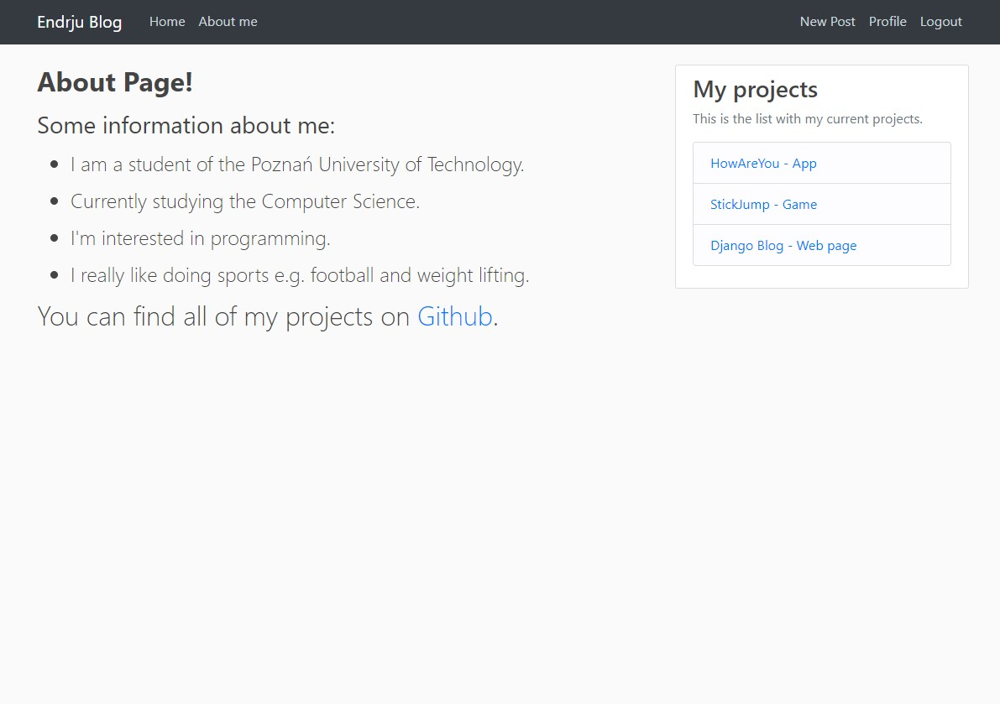
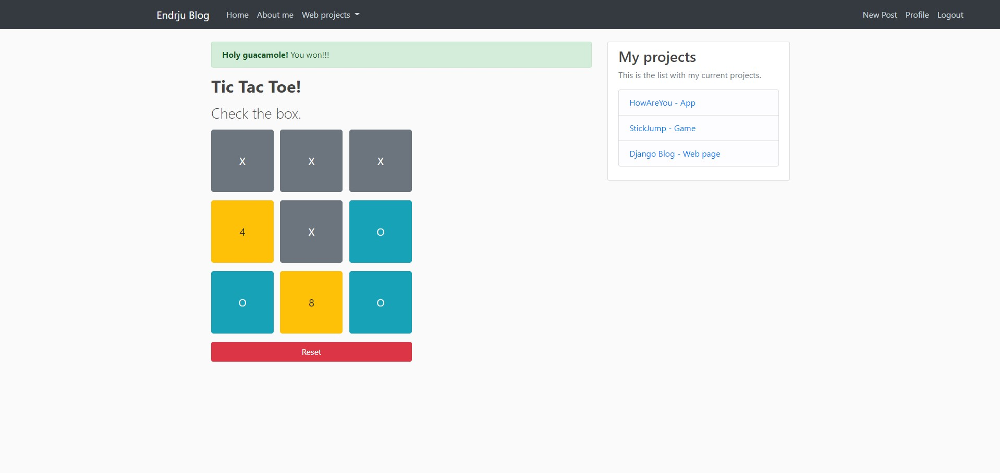

# DjangoBlog
## Table of contents
* [General info](#general-info)
* [Technologies](#technologies)
* [Installation](#installation)
* [Screenshots](#screenshots)


## General info
Project was created for learning Django and creating web pages.
	
## Technologies
Project is created with:
* Python
* Django
* HTML
* CSS

## Installation
1) Create virtual environment

    ```
    python -m venv venv
    ```
    On linux:
    ```
    source venv/bin/activate
    ```
    On windows (cmd):
    ```
    venv\Scripts\activate.bat
    ```
2) Install prerequisites
   ```
   pip install -r requirments.txt
   ```
3) Run django
    ```
    python manage.py runserver
    ```
4) To check your application go to [localhost](http://127.0.0.1:5000/)

## Screenshots
* **Home Page** 


* **About me** 


* **Smaller web projects**
* * Tic Tac Toe



