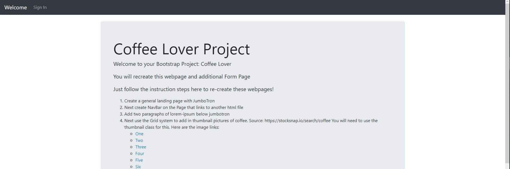
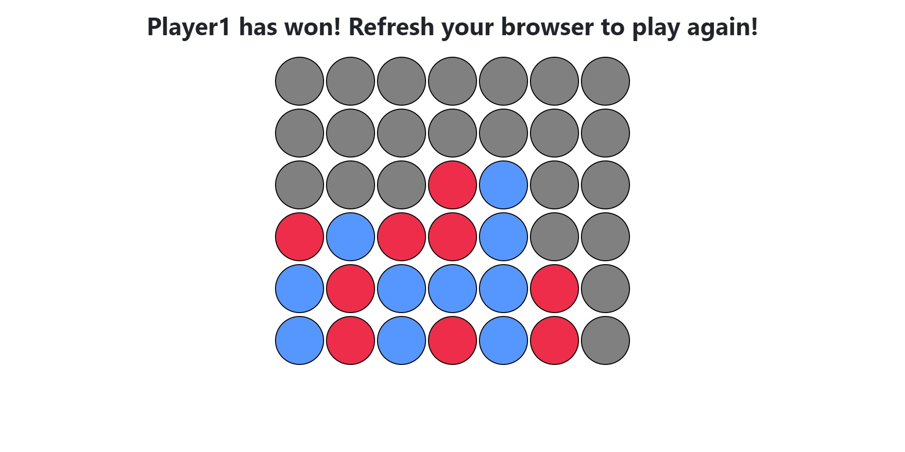

# DjangoBlog
## Table of contents
* [General info](#general-info)
* [Technologies](#technologies)
* [Installation](#installation)
* [Screenshots](#screenshots)
* [Course](#course)


## General info
Project created for the purpose of learning technologies related to web applications (HTML, CSS, JavaScript, Django). It is a blog with the ability to log in, add a profile picture and add posts. The tic-tac-toe game is available in the Web projects tab - the user's opponent selects the fields randomly, and after winning / losing / drawing an appropriate message appears. There is also a Full Stack Web Developer Bootcamp directory in the repository, which contains files and projects / tasks from the course I have been working on on the Udemy platform.
	
## Technologies
Project is created with:
* Python
* Django
* HTML
* CSS
* JS
* jQuery
* Bootstrap

## Installation
1) Create virtual environment

    ```
    python -m venv venv
    ```
    On linux:
    ```
    source venv/bin/activate
    ```
    On windows (cmd):
    ```
    venv\Scripts\activate.bat
    ```
2) Install prerequisites
   ```
   pip install -r requirments.txt
   ```
3) Go to django_project
4) Run django
    ```
    python manage.py runserver
    ```
5) To check your application go to [localhost](http://127.0.0.1:5000/)

## Screenshots
* **Home Page** 


* **About me** 


* **Smaller web projects**
* * Tic Tac Toe

* * Coffe Lover Project (project made as a part of the course)



* * Connect Four (project made as a part of the course)


## Course
Directory named Fullstack Web Developer Bootcamp includes files from course bought on [Udemy](https://www.udemy.com/course/python-and-django-full-stack-web-developer-bootcamp/).

