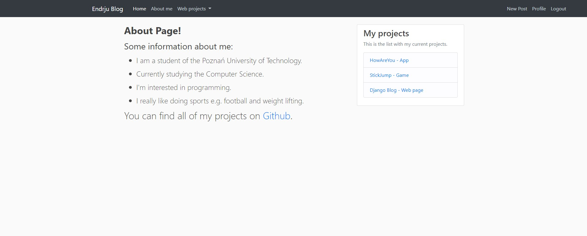

# DjangoBlog
## Table of contents
* [General info](#general-info)
* [Technologies](#technologies)
* [Screenshots](#screenshots)

## General info
Project was created for learning Django and creating web pages.
	
## Technologies
Project is created with:
* Python
* Django
* Pillow
* Bootstrap

## Screenshots
* **Home Page** 

* **About me** 

